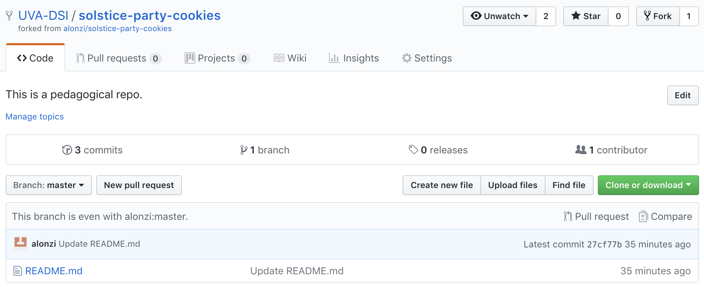
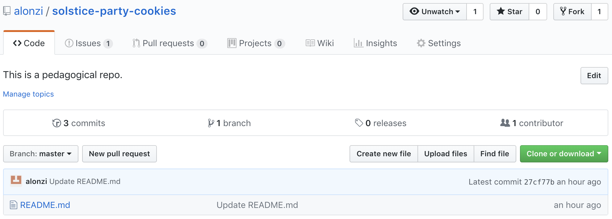

# GitHub

## Contents
* [Glossary](#glossary)
* [Introduction](#introduction)
* [User Archetypes](#user-archetypes)
* [Exercise - Explore a Repository](#Exercise-1---Explore-a-Repository)
* [Development Workflow](#Development-Workflow-for-Collaborator-User-Archetype)
* [Exercise - Suggest a change](#Exercise-2---Suggest-a-change-to-a-Repository)
* [Summary](#summary)
* Secondary Objectives
  * [Compare revisions](#How-to-compare-revisions)
  * [Tricks](#Useful-Tricks)
  * [Resources](#Resources)

## Glossary
|Term   | Definition  | Image  |
|---|---|:---:|
| git  | version control software, distributed model  |   | 
| github | a for-profit company owned by microsoft |  |
| repository/repo| a folder and a record of all changes to constituents ||
| commit| one change record ||
| remote| a non local repo |n/a|
| fork| a repo and a pointer to the remote it 'forked' from ||
| pull request| a request to the remote of your fork to 'pull' your changes ||

## Introduction

## GitHub provides a browser based interface to use version control!

### Every revision has a URL - you can publish a revision by URL and keep developing
### You can always revert to any revision - total freedom to try new things, no breaking your code

# User Archetypes
| Role | Example | Permissions |
|---|---|---|
| Repository Manager | PI for project | read & write: decide which pull requests are accepted |
| Collaborator | Anyone who is working on the project | read: make suggestions via pull request |
| External Audience | Conference attendee / Reviewer / Funding Angency| read |

# Exercise 1 - Explore a Repository

### Roles
  * Repo Manager: Pete
  * Collaborators: Workshop attendees
### Todo
  * Goto: https://github.com/alonzi/solstice-party-cookies
  * Look around
    * **Upper Left Corner:** notebook icon next to 'alonzi/solstice-party-cookies'
      * icon means this is a repo
      * user/repo-name
      * like a compass - on the website look here to tell where you are
    * **Green button** on the right hand side says "Clone or Download" 
      * This is how you pull down the files
      * 3 options - use git and download zip are the most common, there is also an app
    * **List of Files**
      * click on any file to see it
      * README.MD: this is a special file. GitHub displays it automagically
### Does anyone want to make a change?

# Development Workflow for Collaborator User Archetype
1. Fork a repo (on the website)
2. Download to local machine (on the website)
3. Develop the code (on your computer)
4. Upload to GitHub (on the website)
5. Create a pull request (on the website)

# Exercise 2 - Suggest a change to a Repository

1. Fork the repo (button in upper right hand corner)
   * Look at upper left corner and note the new symbol and pointer
   * **This is a completely functional independent repo** - nb: there is now a pointer
2. Use the Green button to download a zip file of the repo
3. On your machine edit a file
4. On the web browser use the 'Upload files' to upload your changed file
5. Click "New Pull Request" - instructions for filling this out will be demonstrated

# Summary

* Red: Master repo - Repo Manager approves changes via pull request from collaborators
* Blue: Fork repo - Used by collaborators to develop code and submit changes via pull request

## How to compare revisions
* use the following URL with two commit hashes
* https://github.com/$USER/$REPO/compare/$REV_A...$REV_B (nb: not a vaild link)
* eg: https://github.com/alonzi/feynman/compare/b08a2a61bb96ccfea3127a92a8c356df3f3b6f0e...master

## Useful Tricks
* https://help.github.com/articles/syncing-a-fork/
* https://services.github.com/on-demand/downloads/github-git-cheat-sheet.pdf
* You can edit a file in your repo through the browser interface (little pencil icon)
* Turn your repo into a website: https://pages.github.com/

## Resources
* https://github.com/alonzi/git-intro
* https://github.com/git/git
* https://git-scm.com/downloads
* https://github.com/Daniel-Mietchen/learning2code/blob/master/version-control.md#platforms
* https://journals.plos.org/ploscompbiol/article?id=10.1371/journal.pcbi.1004947
* https://journals.plos.org/ploscompbiol/article?id=10.1371/journal.pcbi.1004668

# Extras
* How to make a repo

